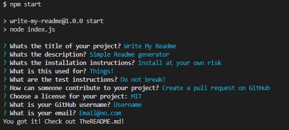
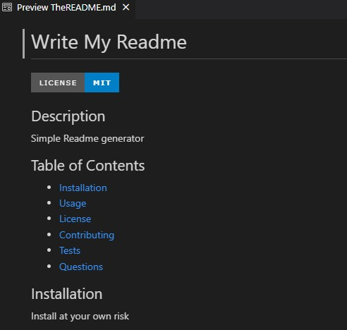

# Write-My-Readme

## Description

 This is a simple README.MD file generator. It is built to help the user generate a good quality readme when the user awnsers a set of questions. This application was built using node.js.

## Table of Contents
* [Installation](#installation)
* [Usage](#usage)
* [Demo](#demo)
* [Sources](#sources)
* [License](#license)
* [Contact](#contact)

## Installation

To use this application do the following:
 1. Verify that node.js is installed in your computer.
 2. Clone this repository: [Write-My-Readme](https://github.com/KSoto18/Write-My-Readme).
 3. Open the integrated terminal on index.js and install Inquirer using the command 'npm i inquirer@8.2.4'.

If you followed these steps, the application should be ready to go!

## Usage

To use the application do the following:
 1. Open the terminal on index.js.
 2. To start the application used the command 'npm start'.
 3. Answer the questions.
 4. A new readme file will be generated with your awnsers called 'TheREADME.md'.
 5. Copy your new readme into your project!

 

 ## Demo
 
 ### Demonstration of the prompted questions
 

  
 

### Demonstration of TheREADME.md
 
 
  

  

 ## Sources
  
  - [Node.js 16.18.0 LTS](https://nodejs.org/en/)
  - [Inquirer 8.2.4](https://www.npmjs.com/package/inquirer/v/8.2.4)

 ## License
 [MIT](https://choosealicense.com/licenses/mit/)

 ## Contact
 For any additional questions you may contact me at: 
 - GitHub: [KSoto18](https://github.com/KSoto18)
 - Email: [Khris.Soto@live.com](mailto:Khris.Soto@live.com)